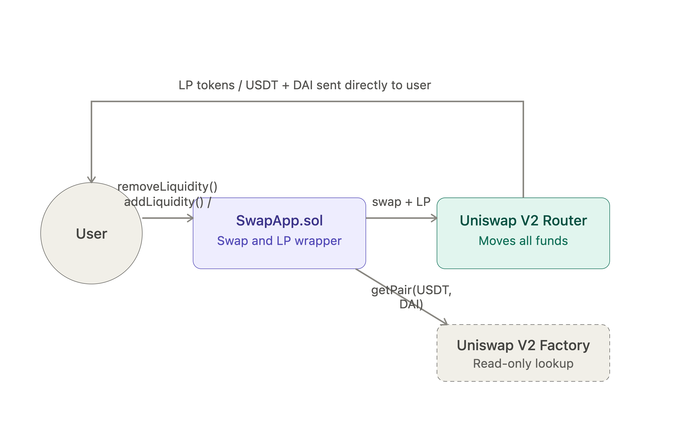

# Liquidity App — Uniswap V2 (Foundry)

A Solidity smart contract that lets a user swap USDT for DAI and add/remove liquidity to a Uniswap V2 pool in a single transaction, built and tested with Foundry against a live Arbitrum mainnet fork.

Part of my Solidity smart contract security portfolio, focused on writing production-style DeFi integrations while applying secure coding patterns.

> Status: **Complete** — 4-test suite passing against a live Arbitrum fork, 100% line/statement/function coverage on `SwapApp.sol`.

## How it works

`SwapApp.sol` never moves funds on its own — it's a thin, opinionated wrapper around the real Uniswap V2 Router. When a user calls `addLiquidity` or `removeLiquidity`, the contract forwards the actual swap and liquidity operations to the Router, which is the only component that touches user funds. The Factory is used exactly once, inside `removeLiquidity`, purely as a read-only lookup to resolve the LP token's address — it never receives or sends a single token.



## Contract

[`src/SwapApp.sol`](https://github.com/alchzamb/liquidity-app-foundry/blob/main/src/SwapApp.sol)

- **`addLiquidity`**: takes USDT from the user, swaps half of it for DAI through the Uniswap V2 Router, and deposits both tokens into the USDT/DAI pool — so the user only needs to hold one token to become a liquidity provider.
- **`removeLiquidity`**: burns the user's LP tokens through the Router and returns the underlying USDT and DAI.
- **`swapTokens`**: a standalone exact-input swap wrapper around `Router.swapExactTokensForTokens`.

## Technical docs

- [`IV2Router02.sol`](https://github.com/alchzamb/liquidity-app-foundry/blob/main/src/interfaces/IV2Router02.sol) — Uniswap V2 Router interface, used for every fund-moving call (swaps, add/remove liquidity).
- [`IFactory.sol`](https://github.com/alchzamb/liquidity-app-foundry/blob/main/src/interfaces/IFactory.sol) — Uniswap V2 Factory interface, used only for the read-only `getPair` lookup.

## Architecture: Router vs Factory

- **Router (`V2Router02`)**: handles every operation that moves funds — swaps, adding liquidity, removing liquidity.
- **Factory**: read-only lookups. Used once, in `removeLiquidity`, to resolve the LP token's address via `getPair(tokenA, tokenB)` — since that address is never returned to the caller during `addLiquidity`.

## Security patterns applied

- **Checks-Effects-Interactions (CEI)**: state changes and token transfers are ordered to minimize reentrancy surface before external calls.
- **`SafeERC20`**: all transfers use `safeTransferFrom`/`safeTransfer` instead of raw ERC20 calls, so tokens that return `false` on failure (instead of reverting) can't silently pass.
- **Pull-then-approve pattern for LP tokens**: `removeLiquidity` explicitly pulls the caller's LP tokens into the contract before approving the Router — since `addLiquidity` mints LP tokens directly to the user (not to the contract), this step is required and is easy to miss.
- **Slippage protection**: every swap/liquidity call exposes `amountOutMin` / `amountAMin` / `amountBMin` parameters, respecting the "never accept less than you're willing to receive" invariant.
- **Deadline protection**: every external call takes a `deadline` to prevent stale transactions from being executed after being front-run or delayed.

## Contract addresses

All addresses below are real, deployed protocol contracts on **Arbitrum One mainnet**, used directly in the fork tests — there's no local mock deployment for this project, since the whole point is exercising the real Uniswap V2 integration.

| Contract | Address |
|---|---|
| Uniswap V2 Router02 | `0x4752ba5DBc23f44D87826276BF6Fd6b1C372aD24` |
| Uniswap V2 Factory | `0xf1D7CC64Fb4452F05c498126312eBE29f30Fbcf9` |
| USDT (Arbitrum) | `0xFd086bC7CD5C481DCC9C85ebE478A1C0b69FCbb9` |
| DAI (Arbitrum) | `0xDA10009cBd5D07dd0CeCc66161FC93D7c9000da1` |

Tests impersonate a real Arbitrum wallet holding a USDT balance (`0xF977814e90dA44bFA03b6295A0616a897441aceC`) via `vm.startPrank`, rather than minting mock tokens — so every assertion reflects real Uniswap pool behavior, not a simplified stand-in.

## Testing

`test/SwapApp.t.sol` — **4 tests, all passing**, run against a live Arbitrum mainnet fork using Foundry's `--fork-url`:

- `testHasBeenDeployedCorrectly`
- `testSwapTokensCorrectly`
- `testCanAddLiquidityCorrectly`
- `testCanRemoveLiquidityCorrectly`

```
forge test --fork-url https://arb1.arbitrum.io/rpc -vv
```

The code has 100% line, statement, and function coverage on `src/SwapApp.sol` — verify with:

```
forge coverage --fork-url https://arb1.arbitrum.io/rpc --report summary
```

```
╭--------------------+-----------------+----------------+----------------+----------------╮
| File               | % Lines         | % Statements   | % Branches     | % Funcs        |
+=========================================================================================+
| src/SwapApp.sol    | 100.00% (24/24) | 100.00% (23/23)| 100.00% (0/0)  | 100.00% (4/4)  |
|--------------------+-----------------+----------------+----------------+----------------|
| Total               | 100.00% (24/24) | 100.00% (23/23)| 100.00% (0/0)  | 100.00% (4/4)  |
╰--------------------+-----------------+----------------+----------------+----------------╯
```

Branch coverage shows 0/0 rather than a percentage — `SwapApp.sol` has no conditional branching (`if`/`require` with multiple paths) of its own; every guard lives in the Router and Factory contracts it calls into, which are out of scope for this repo's coverage.

Covers:
- Correct deployment and constructor wiring.
- Token swap execution with balance assertions.
- Adding liquidity and receiving LP tokens.
- Removing liquidity and recovering the underlying tokens.

## Project structure

```
src/
  SwapApp.sol              # main contract
  interfaces/
    IV2Router02.sol        # Uniswap V2 Router interface
    IFactory.sol           # Uniswap V2 Factory interface
test/
  SwapApp.t.sol             # Foundry fork tests
diagrams/
  LiquidityFlow.png         # how-it-works diagram
```

## Tech stack

- Solidity 0.8.24
- Foundry (Forge + fork testing)
- OpenZeppelin Contracts v5.x (`IERC20`, `SafeERC20`)
- Uniswap V2 (Router02, Factory) on Arbitrum One

## Disclaimer

Built for educational and portfolio purposes as part of a blockchain security accelerator. Not audited — do not use in production without a professional security review.